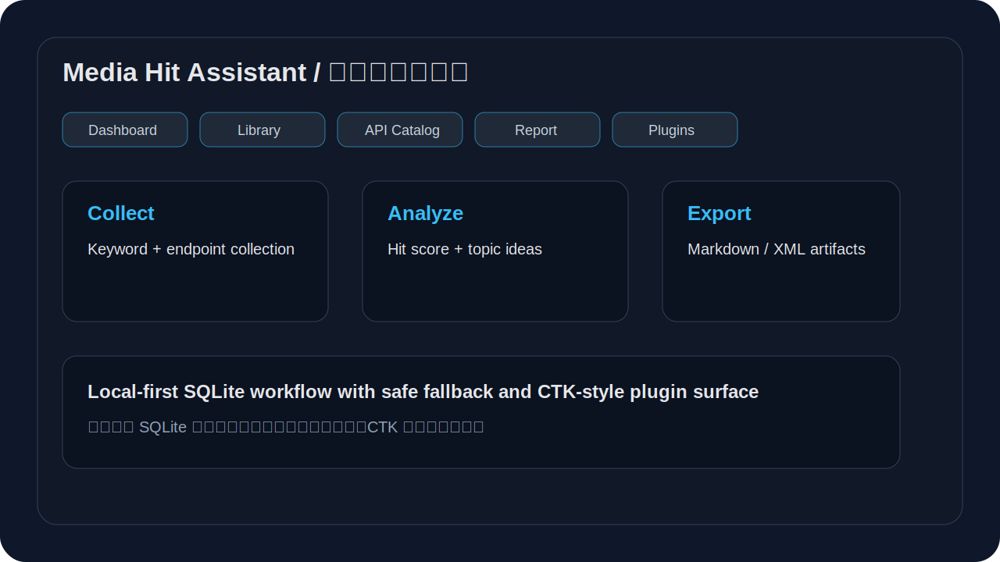

# Media Hit Assistant

<p align="center">
  <strong>A local-first desktop workspace for collecting, analyzing, and exporting public-account hit articles.</strong>
</p>

<p align="center">
  <a href="https://github.com/lxy798132784/Self-media-Viral-Assistant-Jizhile/actions"></a>
  
  
  
  
</p>

## Languages

- English: this README and the `docs/*.md` files.
- Chinese: [`docs/README.zh-CN.md`](docs/README.zh-CN.md) and `docs/zh-CN/*.md`.

## Why this project exists

Content teams often split their workflow across scrdata serviceng tools, spreadsheets, note apps, and report templates. Media Hit Assistant connects the loop in one local desktop application:

1. collect public-account articles by keyword or data service data path;
2. store articles, collection tasks, and run history in SQLite;
3. inspect hit signals such as reads, likes, and derived score;
4. convert strong article patterns into topic ideas;
5. export Markdown and XML artifacts for downstream workflows.

The project is built as a C++20, Qt6, and QML desktop application with a CTK-style plugin surface. Provider data services, exporters, and analyzers can evolve independently while the user workflow remains stable.

## Preview

<p align="center">
  
</p>

## Highlights

| Area | Outcome |
|---|---|
| Dashboard | Quick collection, statistics, and full workflow self-test. |
| Content Library | SQLite-backed article list with detail inspection and Markdown/XML export. |
| data service Catalog | Browse the bundled ContentData data path index, filter by category, and run collection by data path path. |
| Hot Articles data service | Dedicated page for `/fbmain/monitor/v3/hot_typical_search`; every documented parameter has an editable control. |
| Language Switch | The app UI can switch between Chinese and English instead of mixing languages in one label. |
| Analysis Report | Generate hit scores, read/like summaries, and structured observations. |
| Topic Recommendations | Convert high-performing content patterns into next-topic ideas. |
| Plugins | CTK-style Provider, Exporter, and Analyzer registry with fail-closed dynamic-plugin scanning. |
| Settings | access key, verify code, data path path, interval, run count, QPS, export directory, tasks, and run history. |

## Quick start

### Dependencies on Ubuntu 24.04

```bash
sudo apt-get update
sudo apt-get install -y cmake g++ python3 \
  qt6-base-dev qt6-declarative-dev qt6-tools-dev \
  qml6-module-qtquick qml6-module-qtquick-controls qml6-module-qtquick-layouts
```

### Build and test

```bash
cmake -S . -B build -DCMAKE_BUILD_TYPE=Release
cmake --build build -j2
ctest --test-dir build --output-on-failure
```

### Run

```bash
./build/media-hit-assistant
```

Headless self-test:

```bash
QT_QPA_PLATFORM=offscreen ./build/media-hit-assistant --self-test
```

### Full verification gate

```bash
./scripts/verify-all.sh
```

The gate runs the build, CTest suite, offscreen self-test, export-artifact checks, QML control audit, documentation alignment audit, and offscreen launch smoke.

## Configuration

Local tests do not require credentials. If no access key is configured, the app uses safe sample collection so the workflow remains testable without spending data service quota.

Configurable fields:

- Content Data Service key;
- verify code;
- data path path;
- Hot Articles data service parameters: `key`, `keyword`, `pub_type`, `category`, `page`, `start_time`, `end_time`;
- UI language;
- collection interval;
- maximum run count;
- QPS limit;
- export directory.

Do not commit real credentials. Keep secrets in local settings or environment variables only.

## Architecture

```text
QML UI
  -> AppController (Q_INVOKABLE facade)
      -> ConfigManager       local data service and task settings
      -> ApiCatalog          bundled ContentData data path index
      -> ContentDataClient      payloads, HTTP, parsing, retry/fallback
      -> DatabaseManager     SQLite articles, tasks, run history
      -> ExportService       Markdown and XML artifacts
      -> BuiltinPluginRegistry
           -> Provider       source integration point
           -> Exporter       export format extension point
           -> Analyzer       hit-score and future analysis plugins
```

Design principles:

- local-first persistence and offline self-test;
- safe-by-default fallback when credentials are missing;
- plugin-ready extension boundaries;
- verifiable controls through tests and audits;
- cross-platform source delivery for Linux, Windows, Docker, x86_64, and ARM64 Qt builds.

## Packaging

Linux:

```bash
./scripts/package-linux.sh
cmake --install build --prefix /tmp/media-hit-install
```

Windows:

```powershell
.\scripts\package-windows.ps1
```

Docker:

```bash
docker build -t media-hit-assistant .
docker run --rm media-hit-assistant
```

The install target includes the executable, desktop metadata, icon, README, changelog, docs, bundled data service index, and plugin drop-in directory.

## Repository layout

```text
include/        C++ public headers
src/            C++ implementation
ui/             QML desktop interface
tests/          QtTest unit tests
scripts/        build, package, and audit scripts
packaging/      desktop entry, AppStream metadata, and icon
docs/           English docs, Chinese docs, and assets
vendor/         sanitized bundled Content Data Service knowledge
plugins/        plugin drop-in contract and metadata examples
```

## Documentation

English:

- [Project specification](docs/PROJECT-SPEC.md)
- [Architecture](docs/ARCHITECTURE.md)
- [Developer guide](docs/DEVELOPMENT.md)
- [Deployment and development guide](docs/DEPLOYMENT.md)
- [Examples](docs/EXAMPLES.md)
- [Plugin guide](docs/PLUGIN_GUIDE.md)

Chinese:

- [Chinese overview](docs/README.zh-CN.md)
- [Chinese project specification](docs/zh-CN/PROJECT-SPEC.md)
- [Chinese architecture](docs/zh-CN/ARCHITECTURE.md)
- [Chinese developer guide](docs/zh-CN/DEVELOPMENT.md)
- [Chinese deployment and development guide](docs/zh-CN/DEPLOYMENT.md)
- [Chinese examples](docs/zh-CN/EXAMPLES.md)
- [Chinese plugin guide](docs/zh-CN/PLUGIN_GUIDE.md)

Governance:

- [Contributing](CONTRIBUTING.md)
- [Security](SECURITY.md)
- [Changelog](CHANGELOG.md)
- [Code of Conduct](CODE_OF_CONDUCT.md)
- [Release notes template](.github/RELEASE_NOTES.md)
- [Dependabot config](.github/dependabot.yml)

## Quality gates

| Gate | Command |
|---|---|
| Build | `cmake --build build -j2` |
| Unit tests | `ctest --test-dir build --output-on-failure` |
| Self-test | `QT_QPA_PLATFORM=offscreen ./build/media-hit-assistant --self-test` |
| QML controls | `python3 scripts/audit_qml_controls.py` |
| Documentation alignment | `python3 scripts/audit_devprompt_alignment.py` |
| Full verification | `./scripts/verify-all.sh` |
| Package smoke | `./scripts/package-linux.sh` |
| Install smoke | `cmake --install build --prefix /tmp/media-hit-install` |

## Roadmap

- [x] SQLite content library, collection tasks, and run history.
- [x] Markdown and XML export.
- [x] Bundled data service catalog and data path collection.
- [x] Interactive details for articles, data paths, plugins, tasks, and run receipts.
- [x] CTK-style plugin registry and documented plugin drop-in contract.
- [x] Linux, Windows, and Docker delivery scripts.
- [x] Open-source governance files.
- [x] Separate English and Chinese documentation sets.
- [ ] Runtime dynamic CTK library loading.
- [ ] Signed installers.
- [ ] Additional analyzers for title patterns, structure templates, and topic clusters.

## Security

- No secrets are required for local tests.
- Missing credentials trigger safe sample collection.
- Vendor data service examples are sanitized.
- Runtime artifacts, SQLite databases, build outputs, and package outputs are excluded from source delivery.

See [SECURITY.md](SECURITY.md) for the reporting policy.

## Contributing

Read [CONTRIBUTING.md](CONTRIBUTING.md), run `./scripts/verify-all.sh`, and keep user-facing documentation updated when behavior changes.

## License

MIT. See [LICENSE](LICENSE).
